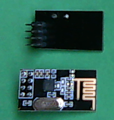
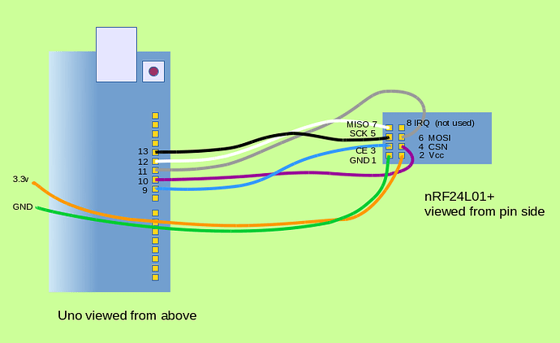

# This is for the 2024 Eng8 Robot
# [Robot Code](robot.ino)
# [Transmitter Code](transmitter/transmitter.ino)
# Hardware
## Robot
### Electronics
- Arduino Uno
- nRF24L01
- [L298P Motor Shield](https://protosupplies.com/product/l298p-motor-driver-shield/)
- 2 `12v` DC Motors
- DC-DC Buck Converter `12v`->`9v`
- 2 **High-Power** Servos (not 9g, metal gears)
### Structural
- Lasercut Chassis
- 3d Printed Wheels with Rubber bands
- Transfer Bearing Caster
### Pin Assignments
- BUZZER = `4`
- Servo1 = `A0`
- Servo2 = `A1`
- x1(Leftmost Dst Sensor) = `TBD`
- x2(Middle Dst Sensor) = `8`
- x3(Rightmost Dst Sensor) = `TBD`
- Trigger(for activating dst sensors) = `7`
#### Motor Shield
- ENA = `5`
- INA = `3`
- ENB = `6`
- INB = `2`
## Transmitter
### Electronics
- Ardiuno Uno
- nRF24L01
- [Fundiuno Shield](https://cb-electronics.com/products/funduino-joystick-shield-v1-a-ky-023-shield/)
- `9v` Battery
- SSD1306 128x64 OLED Screen i2c
### Structural
- 3d Printed Transmitter Body
### Pin Assignments
- Joystick X = `A0`
    - Used for Motor and Scoop Control
- Joystick Y =`A1`
    - Used for Motor and Scoop Tilt Control
- Joystick Button = `8`
    - Hold to turn on fine control mode
- Button A = `2`
    - Hold to use Joystick is to control Scoop
- Button B = `3`
    - Not used currently
- Button C = `4`
    - Not used currently
- Button D = `5`
    - Hold with ButtonA to use old servo control method
- Button E = `6`
    - Used to switch vScreen
- Button F = `7`
    - Used to switch on/off Low Latency Mode
## Motor Shield Docs
The shield is built to directly interface pins `10, 11, 12, 13` to the motor control ic for pwm control.  However, those exact pins are the hardware SPI interface for the wireless module **so we must use different motor control pins.**

Since the arduino uno has hardware PWM on pins `3, 5, 6, 9, 10, 11` we can use these pins instead by bending the shield pins to the side so we can connect them manually to the arduino.
- [Ardiuno](https://www.arduino.cc/reference/en/language/functions/analog-io/analogwrite/)
- [L298P Motor Driver Instructables](https://www.instructables.com/Tutorial-for-L298-2Amp-Motor-Driver-Shield-for-Ard/)
- [Electropeak Tutorial](https://electropeak.com/learn/interfacing-l298p-h-bridge-motor-driver-shield-with-arduino/)
- [Hands On Tech specs](http://www.handsontec.com/dataspecs/arduino-shield/L298P%20Motor%20Shield.pdf)
- [HandsOnTech](HandsOnTec.pdf)
# Wiring
## nRF24

1. nRF24 `pin1` -> Arduino `Gnd`
2. nRF24 `pin2` -> Arduino **`+3.3v`.  If you hook it up to `+5v` it will probably break.**
3. nRF24 `pin3` -> Arduino `IOpin9`
4. nRF24 `pin4` -> Arduino `IOpin10`
5. nRF24 `pin5` -> Arduino `IOpin13`
6. nRF24 `pin6` -> Arduino `IOpin11`
7. nRF24 `pin7` -> Arduino `IOpin12`
8. nRF24 `pin8` **is not required** since we are not using interrupts (IRQs), leave this pin disconnected

## Motor Shield
The shield is built to directly interface pins `10, 11, 12, 13` to the motor control ic for pwm control.  However, those exact pins are the hardware SPI interface for the wireless module **so we must use different motor control pins.**

Since the arduino uno has hardware PWM on pins `3, 5, 6, 9, 10, 11` we can use these pins instead by bending the shield pins to the side so we can connect them manually to the arduino.
- `IOpin2` -> `IOpin12`
- `IOpin3` -> `IOpin13`
- `IOpin5` -> `IOpin11`
- `IOpin6` -> `IOpin10`
## Battery
- We are using rechargeable power drill batteries.  Get a 3D printed battery mount and terminal contacts from Mr. Mayer
- Solder stranded wire to two right angle terminal tabs.
- Insert the tabs into the 3D printed mount, be sure the red wire is on the + side and the black wire is on the - side.
- Mount the 3D printed mount on your robot, there are lots of mounting holes.
- Connect the power wires to the 2 positiong blue screw terminal block.  The black wire goes into the GND terminal, the red wire goes into VMS.
- Note, the power entering here powers everything **as long as the OPT jumper is installed on the Motor Shield**.  That jumper interconnects the motor power to the Arduino power.
# Payload Characteristics; Transmitter -> Robot
## Uses an array with **8** elements, numbered 0-7
0. Value of `Joystick X` from `-100` to `100`
1. Value of `Joystick Y` from `-100 to 100`
### Buttons are ints from `0-1` (0 is pressed down)
2. Value of `Button A`
3. Value of `Button B`
4. Value of `Button C`
5. Value of `Button D`
6. Value of `joyButton`
7. Value of `llMode` (from `0-1`, `1` is engaged)
# ackData Characteristics; Robot -> Transmitter
## Uses an array of **8** elements, numbered 0-7
0. `motorA` Motor A power percent (`0-100`)
1. `motorB` Motor B power percent (`0-100`)<del>
2. `x1` Distance value for leftmost distance sensor (centimeters)
3. `x2` Distance value for middle distance sensor (centimeters)
4. `x3` Distance value for rightmost distance sensor (centimeters)</del>
5. `servo1` Rotation of leftmost servo (degrees)
6. `servo2` Rotation of rightmost servo (degrees)
7. Whether doingLL is true `0-1`(`1` is engaged)
