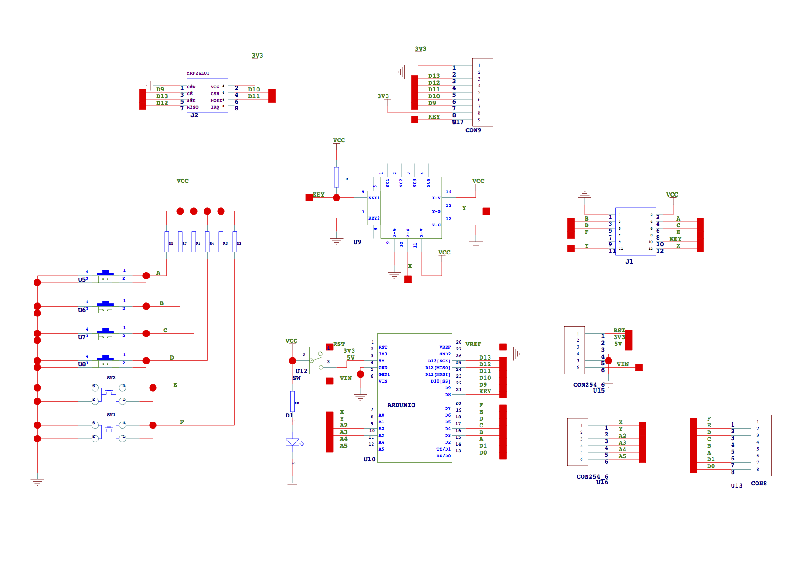

# This is for the 2024 Eng8 Robot
# Members
- Will Benkhe
- William Braskamp
- Hamzah Salman
- Hunter Dorrill
# Hardware
- Arduino Uno (or compatable clone)
- [Fundiuno Shield](https://cb-electronics.com/products/funduino-joystick-shield-v1-a-ky-023-shield/)
- 9g Micro Servo (IO Pin 9)
# Fundiuno Schematic

# Motor Shield Docs
The shield is built to directly interface pins 10, 11, 12, 13 to the motor control ic for pwm control.  However, those exact pins are the hardware SPI interface for the wireless module so we must use different motor control pins.

Since the arduino uno has hardware PWM on pins 3, 5, 6, 9, 10, 11, we can use these pins instead by bending the shield pins to the side so we can connect them manually to the arduino.
[Ardiuno](https://www.arduino.cc/reference/en/language/functions/analog-io/analogwrite/)
[L298P Motor Driver Instructables](https://www.instructables.com/Tutorial-for-L298-2Amp-Motor-Driver-Shield-for-Ard/)
[Electropeak Tutorial](https://electropeak.com/learn/interfacing-l298p-h-bridge-motor-driver-shield-with-arduino/)
[Hands On Tec specs](http://www.handsontec.com/dataspecs/arduino-shield/L298P%20Motor%20Shield.pdf)
